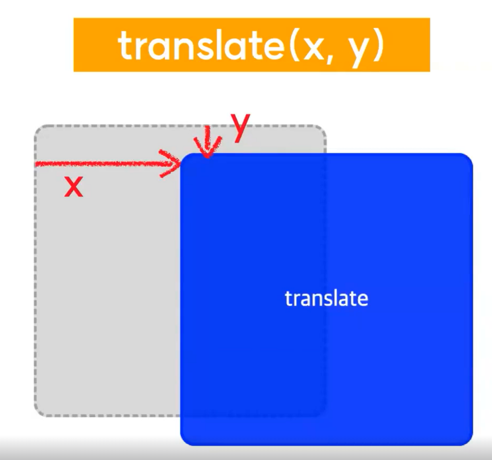
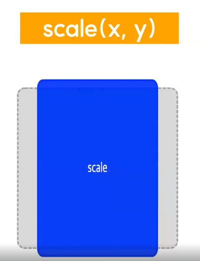
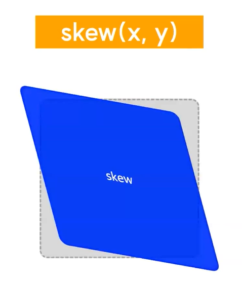
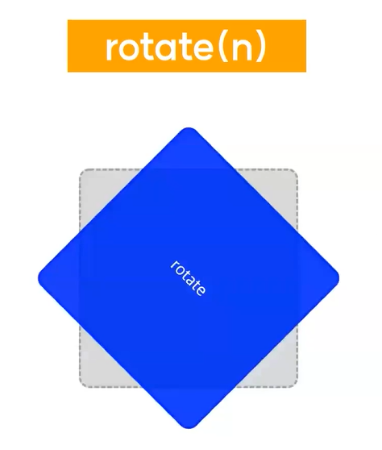

# Transform
## 1. transform
1. 변형 시킨다는 의미
2. 요소에 이동, 회전, 확대축소, 비틀기 등의 변형 효과를 줄 수 있다.
3. 속성값
    - translate(x, y)
    - scale(x, y)
    - skew(x-angle, y-angle)
    - rotate(angle)

## 2. translate(x, y)

- 요소의 좌표를 움직일 수 있다.
- X축으로 x만큼, Y축으로 y만큼 이동시킨다.
- 예시) `transform : translate(20px, 25%)`
- 입력값은 양수, 음수 모두 가능하다.
- 입력값을 하나만 입력할 경우, X와 Y축 모두 해당 값이 적용된다.
    - X축 또는 Y축 둘 중 하나에만 값을 입력하고 싶다면 `translateX()` 또는 `translateY()`를 이용하면 된다.

    ## 2-1. translateX(n)
    - 요소의 X축 좌표를 n만큼 움직일 수 있다.
    - 예시) `transform : translateX(n)`

    ## 2-2. translateY(n)
    - 요소의 Y축 좌표를 n만큼 움직일 수 있다.
    - 예시) `transform : translateY(n)`

## 3. scale(x, y)

- X축으로 x만큼, Y축으로 y만큼 요소를 축소 혹은 확대한다.
- 예시 ) `transform : scale(0.75, 1.1)`
- 이때, 입력값의 기준은 `1.0` 이다.

    ## 3-1. scaleX(n)
    - 요소를 X축 방향으로 n만큼 축소 혹은 확대한다.
    - 예시) `transform : scaleX(1.1)`

    ## 3-2. scaleY(n)
    - 요소를 Y축 방향으로 n만큼 축소 혹은 확대한다.
    - 예시) `transform : scaleY(1.1)`

## 4. skew(x, y)

- X축으로 x도 만큼, Y축으로 y도 만큼 요소를 기울인다.
- 예시) `transform : skew(15deg, 10deg)`

    ## 4-1. skewX(x)
    - 요소를 X축으로 x도 만큼 기울인다.
    - 예시) `transform: skewX(15deg)`

    ## 4-2. skewY(y)
    - 요소를 Y축으로 y도 만큼 기울인다.
    - 예시) `transform: skewY(15deg)`

## 5. rotate(n)

- 요소를 n만큼 회전시킨다.
- 예시) `transform: rotate(n)`

