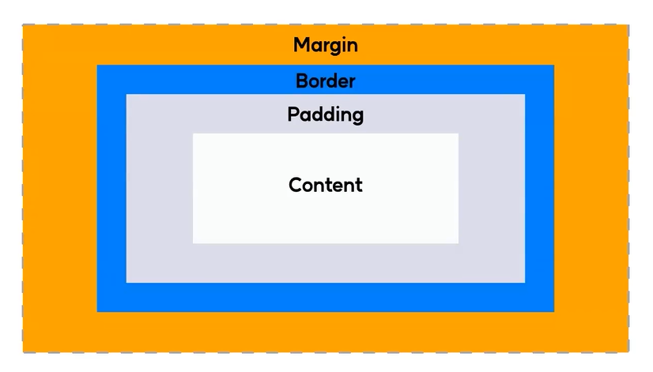
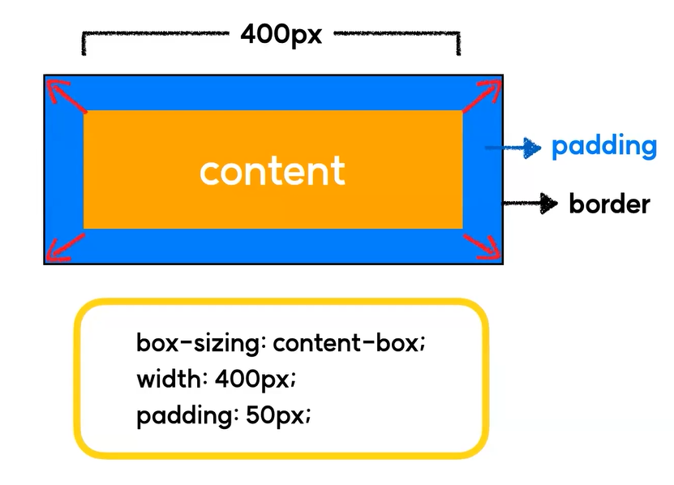
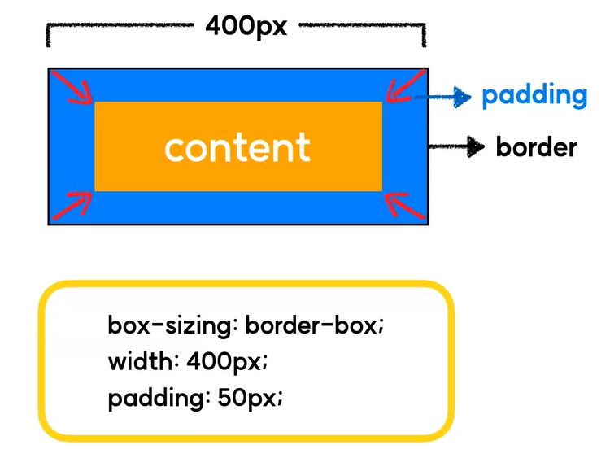

# Box Model
## 1. Box Model이란?
- 웹 브라우저에서 HTML Element를 구성할 때 각각의 요소가 차지하는 박스 공간을 정의한 모델
- 모든 HTML요소는 박스 형태로 되어있다!

    

- 내용이 들어가는 **Content Box**
- Content Box를 감싸는 여백, **Padding Box**
- Padding Box를 감싸는 외곽, **Border Box**
- 외부 여백에 해당하는 **Margin Box**

## 2. 실습
```html
<div class="box1">
    box1 입니다.
</div>
<div class="box2">
    box2 입니다.
</div>
```
```css
div {
    width : 200px;
    height : 200px;
    background: lightgray;
}

.box1 {
    padding : 50px;
    border : 1px solid blue;
}
```


- box1 과 box2 모두 `width : 200px`, `height : 200px` 이지만, box1은 `padding : 50px` 이 추가로 적용되었다.
- 즉, 두 div의 차이점은 `padding`값의 적용 유무이다.
- 똑같은 넓이와 높이가 적용된 div 중에서 왜 `padding` 값이 적용된 div만 커지는 것일까?

## 3. box-sizing 속성
### 3-1. content-box (기본값)
- `Content영역`을 기준으로 box의 size를 적용
- Content영역을 기준으로 padding을 주기때문에 박스의 외곽선이 밀려나, 지정한 width값보다 더 커보인다.

    

### 3-2. border-box
- `Border영역`을 기준으로 box의 size를 적용
- Border영역을 기준으로 padding값을 주기 때문에, 박스의 외곽선(border)이 지정한 width값과 일치한다.
- 때문에 주로 `box-sizing`은 `border-box`를 사용한다.

    
    
