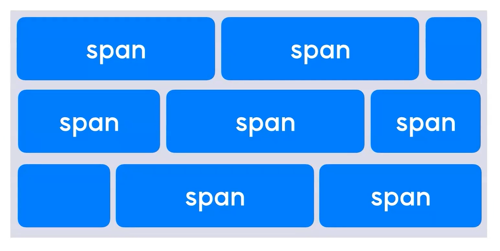

# Inline 요소 vs Block 요소
## 1. block 요소
- 블록 요소를 여러개 연속해서 쌓을 경우, 자동으로 다음 줄로 넘어간다.
- 좌/우 양쪽으로 늘어나 부모 요소의 너비를 가득 채운다.

## 2. inline 요소
- 여러개의 요소를 연속해서 입력해도 자동으로 다음 줄로 넘어가지 않는다.
- 태그에 할당된 공간 만큼의 너비만 차지한다.

## 3. Inline/Block요소 정리
<table>
    <thead>
        <tr>
            <th>Block요소</th>
            <th>Inline요소</th>
        </tr>
    </thead>
    <tbody>
        <tr>
            <td>
            div, p, ul, dl,
            p, h1, h2, h3, h4, h5 등
            </td>
            <td>
            a, span, img, strong, em, input, button, textarea, select 등
            </td>
        </tr>
    </tbody>
</table>