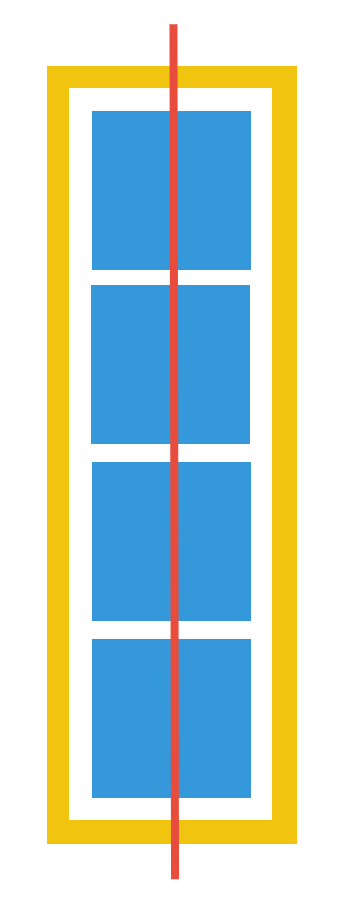

# Flex 레이아웃
## 1. 요소의 속성을 flex로 변경
```css
display : flex
```
- flex-container : "display : flex"가 적용된 요소
- flex-item : flex-container의 자식요소

## 2. flex-direction : row | column → 중심축의 방향 결정하기    
- 정렬의 기준이 되는 방향을 결정하는 속성
    - flex-direction : row(기본값)

        
    - flex-direct : column

        
    - 추가적으로, [row-reverse와 column-reverse](https://developer.mozilla.org/en-US/docs/Web/CSS/flex-direction) 속성으로 안에 든 아이템의 순서를 뒤집어주는 속성도 존재함.