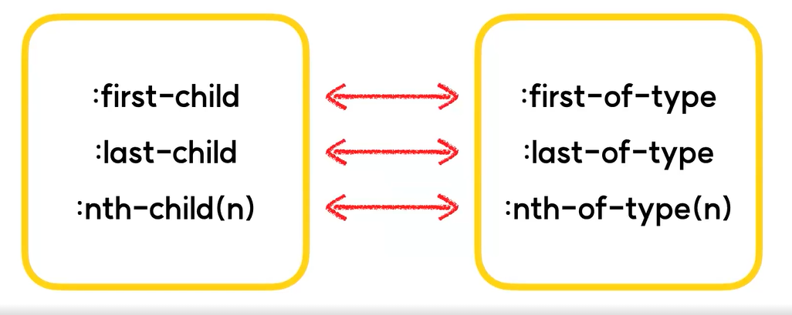
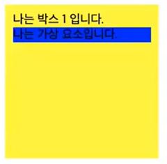
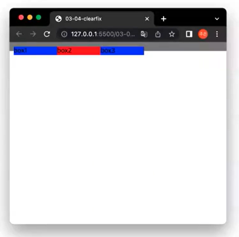
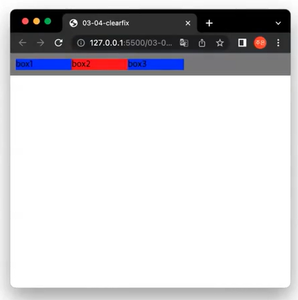

# 선택자3
## 1. 가상 클래스 선택자
### 1-1. :first-of-type
- `:first-child`와 비슷하지만 엄연히 다름!
    ```css
    .container p:first-child {
        background : red;
    }
    ```
    ```html
    <div class="container">
        <h1>제목</h1>
        <p>첫번째 p</p>
        <p>두번째 p</p>
        <span>첫번째 span</span>
        <p>세번째 p</p>
    </div>
    ```
    - 실행해보면, `background:red`가 적용된 요소는 존재하지 않음.
    - 그 이유는 `.container p:first-child` 해당 선택자를 잘 살펴보면, `.container`라는 부모요소 밑에 있는 첫번째 자식요소 p 태그를 선택한다. (`.container`요소 하위에 있는 p태그에 한해서만 카운트하는 것이 아니라, `.container`요소 하위에 있는 모든 요소에 대해 카운트를 하는 것!)
    - 하지만 실제로 `.container`부모요소 밑에 첫번째 자식요소는 p 태그가 아닌 h1태그임.
    - 따라서 `.container p:first-child` 선택자에 해당하는 요소는 존재하지 않기때문에 `background:red`가 적용된 요소는 존재하지 않는다.

- 그렇다면, `:first-of-type`은?
    - 형제 요소 중 첫번째 요소를 선택하는 가상 클래스
    - 하지만 `:first-child`와는 다르게 `:first-of-type`이라는 가상 클래스가 적용된 선택자에 해당되는 요소만 카운트한다. (위 `:first-child`의 예시를 들면, `.container p:first-of-type`의 경우, `.container`하위 p태그에 한해서 첫번째 p태그!)
    ```css
    .container p:first-of-type {
        background : red;
    }
    ```
    ```html
    <div class="container">
        <h1>제목</h1>
        <p>첫번째 p</p> <!--background : red-->
        <p>두번째 p</p>
        <span>첫번째 span</span>
        <p>세번째 p</p>
    </div>
    ```

- 그 외, `:last-of-type`, `:nth-of-type(n)` 이 존재한다.
    

### 1-2. :active
- 활성화된 요소를 선택하는 가상 클래스 선택자
    - 활성화된 요소란, 버튼 등을 클릭해서 요소의 동작이 활성화되어있는 상태

### 1-3. :focus
- focus를 받고 있는 입력 창 등의 요소를 선택하는 가상 클래스 선택자
    - Tab 키 등을 이용해서 입력창의 커서가 활성화되어있는 상태

### 1-4. :visited
- 사용자가 방문한 적 있는 링크를 선택하는 가상 클래스 선택자

### 1-5. [after, focus, visited 실습](./2-1-index.html)

## 2. 가상 요소 선택자
### 2-1. 예시
- 실제로 html요소를 수정하지 않고, css만으로 가상 요소를 추가해 선택할 수 있다.
    ```css
    .box1 {
        width: 200px;
        height: 200px;
        background: yellow;
        padding: 10px;
        box-sizing: border-box;
    }
    .text {
        background: blue;
        margin: 0;
    }
    ```
    ```html
    <div>
        <div class="box1">
            나는 박스 1 입니다.
            <p class="text">
                나는 text 입니다.
            </p>
        </div>
    </div>
    ```

    

- 이를 가상 요소 선택자 :after를 이용해 만들어 본다면?
    ```css
    .box1 {
        width: 200px;
        height: 200px;
        background: yellow;
        padding: 10px;
        box-sizing: border-box;
    }
    .box1:after {
        content: "나는 가상 요소입니다.";
        display: block;
        background: blue;
    }
    ```
    ```html
    <div>
        <div class="box1">
            나는 박스 1 입니다.
        </div>
    </div>
    ```
    
    

    - `:after`라는 가상 요소 선택자를 이용해서 `"나는 가상 요소입니다."`라는 내용이 들어가있는 가상의 div를 만들어 넣은 것을 확인할 수 있다.
    - `:after`선택자를 사용할 경우 `content`라는 속성을 사용하게 되는데, `:after`를 이용하여 만드는 가상요소는 본질적으로 html상에서는 존재하지 않기 때문에 `content`를 이용해서 반드시 내용을 채워주어야 한다. 빈 값이라도!`("")`

- 가상 요소 선택자의 장점, html 구조를 단순화시켜준다.
    - 중요한 내용이 아니거나, 디자인적인 이유로 들어갈뿐 의미상 큰 내용이 없는 html 굳이 태그를 추가하지 않고 가상 요소 선택자를 이용하여 추가해주는 것도 좋은 방법이다.

### 2-2. 응용
- Clearfix 복습
    ```css
    * {
        box-sizing: border-box;
        padding: 0;
        margin: 0;
    }
    
    .container {
        padding: 10px;
        background: gray;
    }

    .container .box {
        width: 100px;
        float: left;
        background: blue;
    }

    .container .box:nth-of-type(2n) {
        background: red;
    }
    ```
    ```html
    <div class="container">
        <div class="box">
            box1
        </div>
        <div class="box">
            box2
        </div>
        <div class="box">
            box3
        </div>
    </div>
    ```
    

    - `.container`안에 box가 깔끔하게 들어가지 않는 것을 확인할 수 있다.

    ```css
    * {
        box-sizing: border-box;
        padding: 0;
        margin: 0;
    }

    .container {
        padding: 10px;
        background: gray;
    }

    .container .box {
        width: 100px;
        float: left;
        background: blue;
    }

    .container .box:nth-of-type(2n) {
        background: red;
    }

    /*추가*/
    .clearfix {
        clear: both;
    }
    ```
    ```html
    <div class="container">
        <div class="box">
            box1
        </div>
        <div class="box">
            box2
        </div>
        <div class="box">
            box3
        </div>
        <div class="clearfix"></div> <!--추가-->
    </div>
    ```
    

    - 마지막에 `.clearfix`를 추가해주어 `clear: both` 속성을 주면 box가 `.container`안에 깔끔하게 들어간 것을 확인할 수 있다.

- 가상 요소 선택자를 이용해서 더 깔끔한 clearfix를 적용해보기
    ```css
    * {
        box-sizing: border-box;
        padding: 0;
        margin: 0;
    }

    .container {
        padding: 10px;
        background: gray;
    }

    .container .box {
        width: 100px;
        float: left;
        background: blue;
    }

    .container .box:nth-of-type(2n) {
        background: red;
    }

    /*변경*/
    .clearfix:after {
        content: "";
        display: block;
        clear: both;
    }
    ```
    ```html
    <div class="container clearfix"> <!--clearfix 클래스명 추가-->
        <div class="box">
            box1
        </div>
        <div class="box">
            box2
        </div>
        <div class="box">
            box3
        </div>
    </div>
    ```

## 3. 형제 요소 선택자
- A와 같은 부모를 가지고 있는 형제 요소들 중 B를 선택한다.
    ```css
    A ~ B {
        property: value
    }
    ```

- 예시
    ```css
    .container {
        background: #f4f4f4;
        border: 1px solid blue;
    }

    /*.text와 같은 부모를 가지고 있는 형제 요소 span 모두!*/
    .text ~ span {
        background: red;
    }
    ```
    ```html
    <div class="container">
        <p class="text">나는 text입니다.</p>
        <span>나는 span입니다.</span> <!--background: red-->
        <span>나는 두번째 span입니다.</span> <!--background: red-->
    </div>
    <span>나도 span입니다.</span>
    ```

## 4. [CSS Diner](https://flukeout.github.io/) : CSS 선택자 연습게임