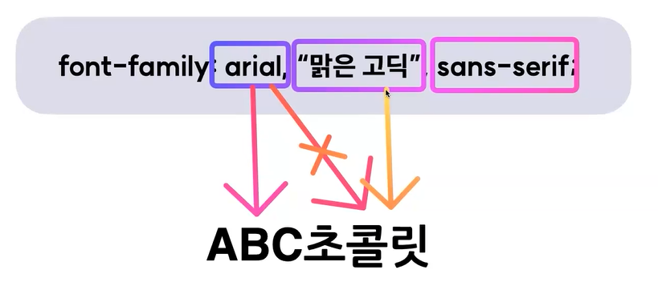

# Web Font
## 1. font-family
- `font-family : "폰트 이름"`
    - 폰트이름 사이 공백이 없다면 쌍따옴표 생략가능
    - 보통 `font-family` 에는 여러 폰트를 작성할 수 있는데, 이때 작성된 순서대로 우선순위를 갖게 된다. 
    - 아래 예시에선 body태그에 맑은 고딕을 우선 적용해보고, 맑은 고딕이 body요소에 알맞지 않다면 다음 순위인 돋움, 그 다음은 sans-serif 가 적용된다.
        ```css
        body {
            font-family: "맑은 고딕", "돋움", sans-serif;
        }
        ```
    - 아래 예시에선 `"ABC초콜릿"` 이라는 요소에 폰트를 적용하는데, `arial`폰트는 영문 폰트이므로 `"ABC"` 에는 적용이 되지만, `"초콜릿"`에는 적용되지 못한다.    
    두번째 순위인 `맑은 고딕`폰트는 한글 폰트이므로 `"초콜릿"`에 적용이 가능하다.    
    이러한 경우에는 `ABC`는 `arial`폰트가, `초콜릿`은 `맑은 고딕`폰트가 적용된다.
        
    - 마지막에 위치한 `sans-serif`폰트는 앞에 지정한 모든 폰트가 사용이 불가능할때 사용되는 일종의 안전장치이다.
    - 사용자의 컴퓨터에서 `sans-serif`계열의 폰트를 찾아 이를 적용시키는 것. 
        - sans-serif : 고딕체
        - serif : 바탕체
        - cursive : 필기체
    - ※주의 : 유저 컴퓨터에도 폰트 파일이 설치되어있어야 글씨체가 제대로 보임

## 2. 설치 없이도 사용가능한, Web Font
- 웹 전용 폰트
- 사용자가 로컬(컴퓨터)에 폰트를 직접 설치하지 않아도 특정 서버에 위치한 폰트를 다운받아 웹페이지에 표시해줌
### 적용 방법
1. 폰트 파일을 직접 다운로드 받아서 적용하는 방법 : @font-face 이용
    - 웹폰트 파일 확장자 종류 : woff / woff2 / ttf / eot
2. 외부 서비스에서 제공하는 링크를 이용하는 방법 : @import 혹은 \<link> 이용