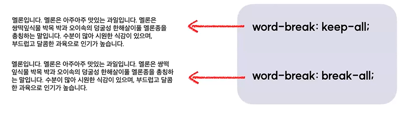

# Font 속성
## 1. font-size
- 텍스트의 크기를 지정한다.

## 2. font-weight
- 텍스트의 두께를 지정한다.
- `bold`, `regular` 와 같은 키워드 입력도 가능하고 `100`, `200` 등 숫자 입력도 가능하다.

## 3. text-decoration
- 텍스트에 장식용 선을 추가한다.

    

## 4. color
- 텍스트의 색을 지정한다.

## 5. line-height
- 텍스트의 행간을 설정한다.
- 설정값은 기본적으로 배율로 적용되기때문에, 배율로 적용할 것이 아닌경우 단위(px 등)를 꼭 함께 써주기

    

    - 위에서부터
        - 텍스트기준 1배
        - 텍스트기준 1.8배
        - 52px

## 6. letter-spacing
- 텍스트의 자간을 설정한다.
    - 기본은 `normal`

    

## 7. word-spacing
- 텍스트의 단어 간 간격을 지정한다.

    

## 8. text-align
- block요소나 표 안에서 텍스트의 가로 정렬 방식을 지정한다.

    

    

## 9. vertical-align
- inline요소나 표 안에서 텍스트의 세로 정렬 방식을 지정한다.

    

## 10. text-indent
- 텍스트의 들여쓰기를 설정한다.
    - 기본값은 0
    - 입력값으로 음수, 0, 양수 사용가능

    

## 11. text-transform
- 영문 텍스트의 대/소문자를 바꾼다.
    - 기본값은 none

    

## 12. word-break
- 텍스트가 콘텐츠 박스 영역 밖으로 넘쳤을 때, 어떻게 줄을 바꿀지 설정한다.

    

    - `word-break : keep-all;` : 행을 나눌때, 어절단위(띄어쓰기)로 나눔
    - `word-break : break-all;` : 행을 나눌때, 글자단위로 나눔

## 13. overflow-wrap
- 단어가 콘텐츠 박스 영역 밖으로 넘쳤을 때, 줄바꿈 여부를 설정한다.

    

- 앞서 배운 `word-break : break-all` 과 비교해본다.

    
    
    - 두 속성은 비슷해보이지만 차이점이 존재한다.
    - `overflow-wrap: break-word;` 는 기본적으로 음절(띄어쓰기)을 기준으로 줄을 바꾸지만, 예시에 나온 WATERMELON처럼 한 줄에 들어가지 않는 긴 단어에 한해서만 영역을 벗어나는 부분을 줄바꿈해준다.
    - 반면에 `word-break: break-all;`은 글자단위로 줄바꿈을 하므로 WATERMELON 이라는 한 단어가 W / ATERMELO / N 과 같이 3줄로 쪼개지면서 가독성이 떨어진다.
    - 따라서 위와 같은 상황에선 `overflow-wrap: break-word;` 를 사용하는 것이 좋다.

## 14. overflow
- 콘텐츠가 커서 요소 안에서 내용을 다 보여주기 힘들 때, 어떤 방식으로 보여줄지 설정한다.

    

    

    - `overflow : auto;` 는 평소에는 스크롤이 없다가, 콘텐츠가 요소 밖으로 넘칠때 스크롤이 생김

## 15. text-overflow
- **※줄바꿈을 하지 않을 때※**, 요소 밖으로 넘치는 text를 어떻게 표기할 것인지 설정한다.
- "줄바꿈을 하지 않을 때" 라는 선행조건을 만족하기 위해서는 아래의 선언들도 함께 적용되어야 한다.
    ```css
    white-space : nowrap;
    overflow : hidden;
    ```