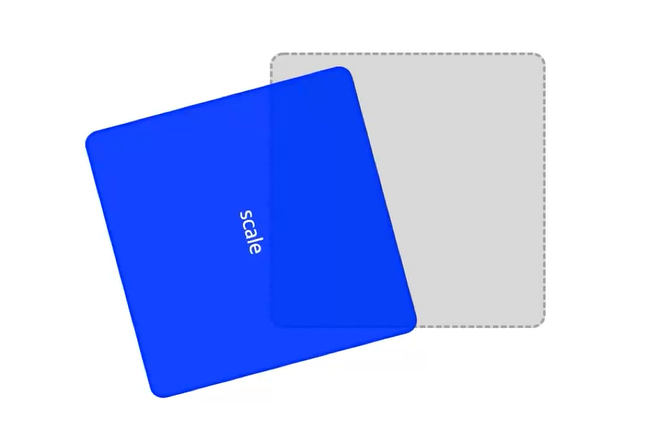
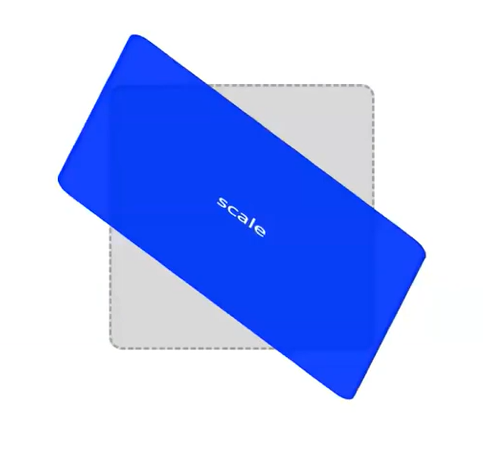
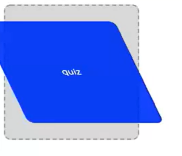

# [Quiz] Transform 중첩 적용
## transform은 변환 함수를 중첩 적용 시키는 것이 가능한 속성이다.
### 1. Q1. 요소를 75도 회전시키고, y축 방향으로 120px 이동
> `transform : rotate(75deg) translateY(120px)`

### Q2. 요소를 x축 방향으로 30도, y축 방향으로 10도 기울이고 45도 회전
> `transform : skew(30deg, 10deg) rotate(45deg)`

### Q3. 요소를 y축 방향으로 0.75 축소시키고 x축 방향으로 20도 기울이기
> `transform : scaleY(0.75) skewX(20deg)`

