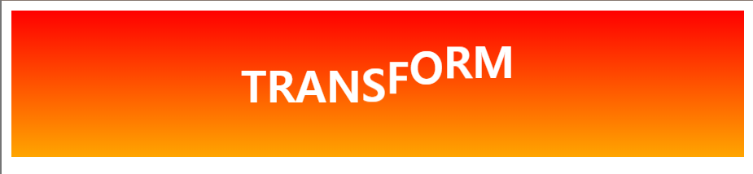

# Transform + Transition
## transform
- transform은 trasition이나 animation과 함께 사용하여 더 다채로운 애니메이션 효과를 만들 수 있다.
- 동적인 UI를 만들 수 있음

## [실습1 : 마우스 hover시 움직이는 텍스트](./6-3-index-1.html)

## [실습2 : 쇼핑몰 아이템 목록](./6-3-index-2.html)
