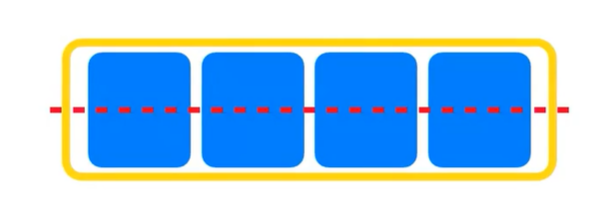
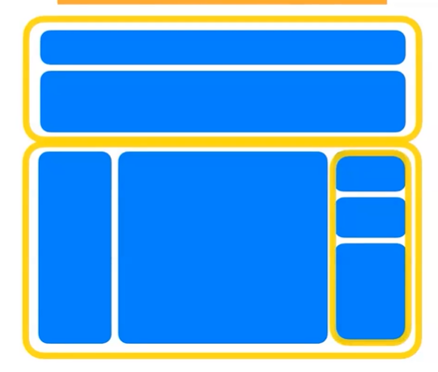
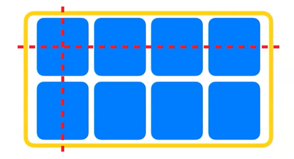
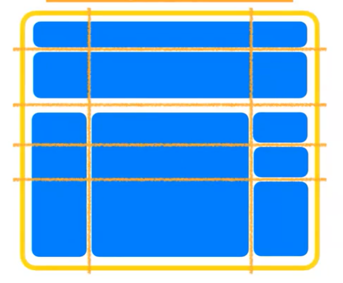

# grid 레이아웃
## 1. css 레이아웃의 흐름
1. Float 레이아웃 : 이제는 거의 사용하지 않음
2. Flex 레이아웃
3. Grid 레이아웃
    - Flex 레이아웃과 Gird 레이아웃은 현재 CSS 레이아웃의 양대산맥
    - 상황에 따라 혼용해서 사용하기도 함

## 2. Flex VS Grid
### 2-1. Flex
- 1차원적 구조 : row 혹은 colume 방향 택1

- 가로, 세로 중 한 방향을 선택해서 레이아웃을 짤 수 있음

    

- Flex를 이용하여 위와 같은 레이아웃을 구성한다면 우선은 위와 아래로 구분지어야 한다.
- 이유는 Flex는 하나의 Container 박스에서 세로와 가로를 중첩하여 사용할 수 없기 때문에, 가로로 정렬되어있는 상단과 세로로 정렬되어있는 하단을 나누어야 하기 때문이다.
- 그 후, 오른쪽 하단에 가로방향으로 정렬되어있는 세 개의 요소 또한 또 다른 container로 묶어 처리해주어야 한다.
- 즉, Flex를 이용하여 복잡한 레이아웃을 짤 때에는 여러번 Flex를 중첩시켜주어야만 한다.
### 2-2. Grid
- 2차원적 구조 : row와 column 레이아웃 동시 설정 가능

- 하나의 container 안에다가 X축과 Y축을 원하는만큼 배치시킬 수 있음.

    

- 따라서 앞서 Flex와는 다르게 Grid를 이용하면 여러번 container를 쪼갤 필요가 없음.