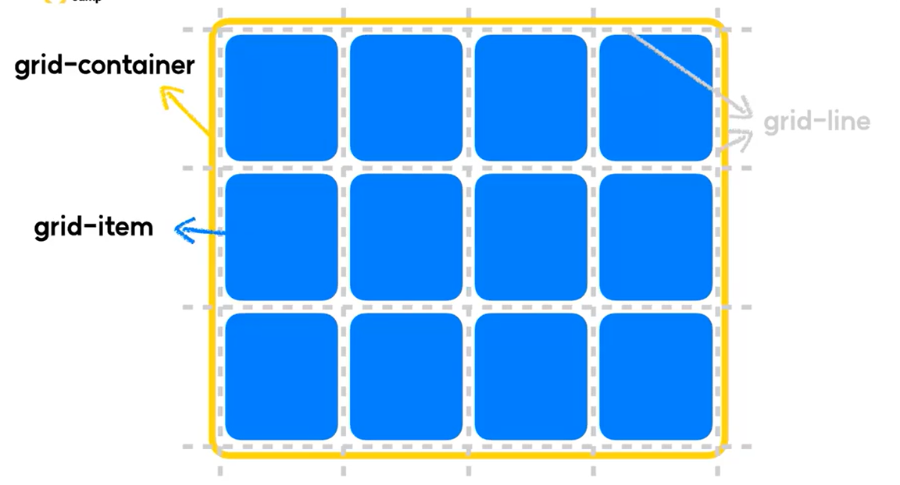
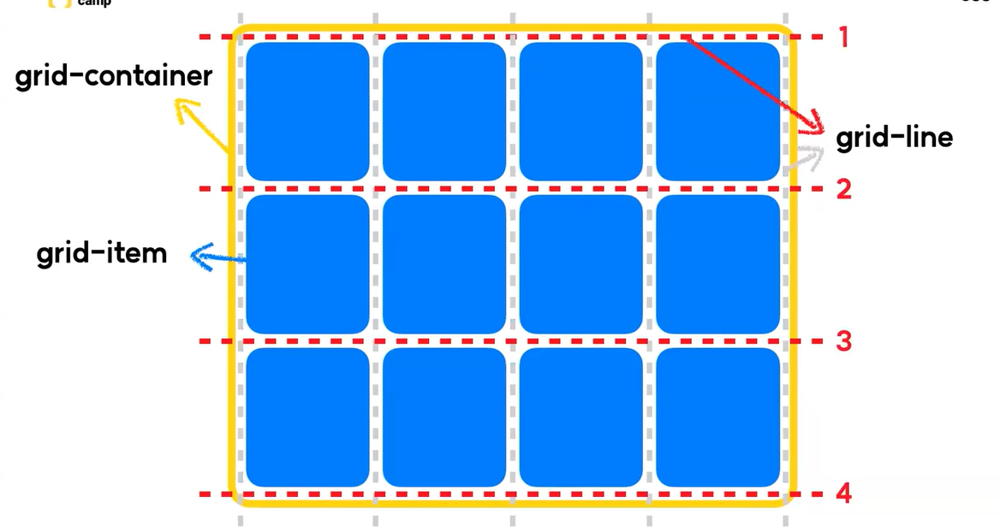
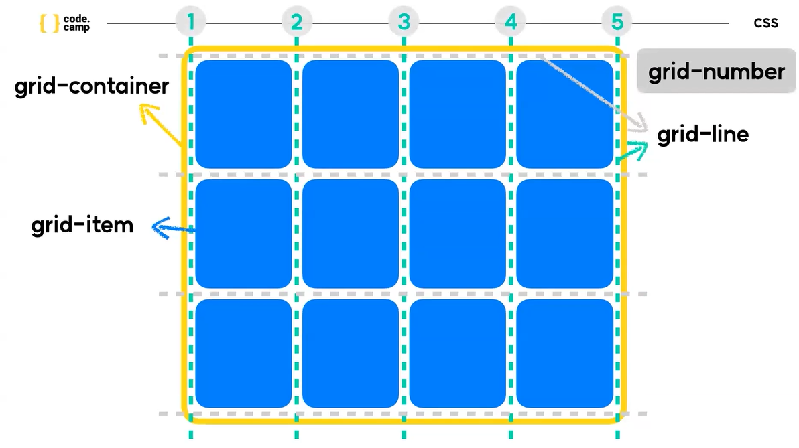
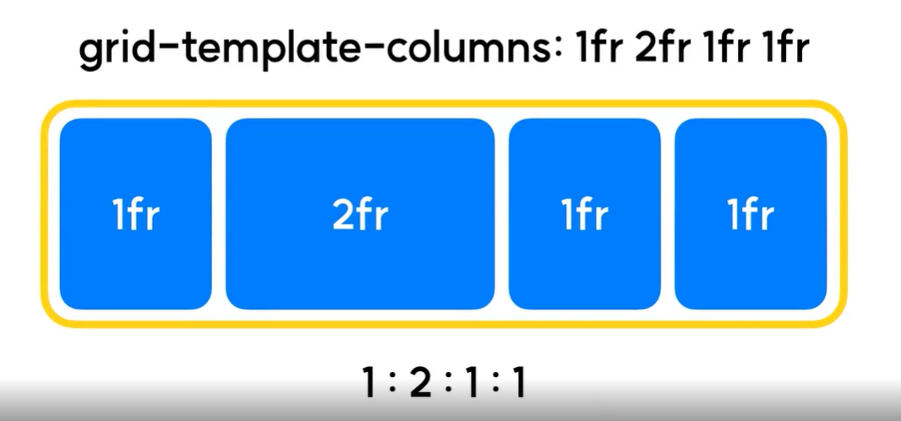
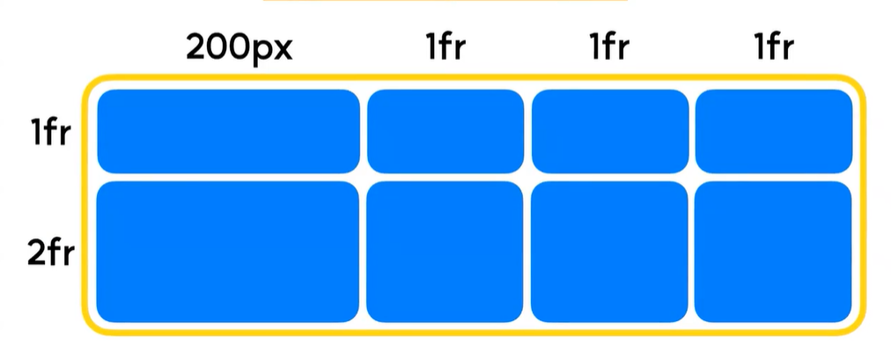
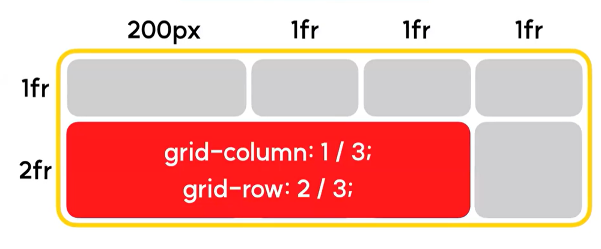

# grid 사용법
## 1. 요소의 속성을 grid로 변경
- 요소에다 `display : grid` 를 주었을때, 그 요소는 `grid container`가 되며, 그 자식요소들은 `grid item`이 된다.
- 또한 gird layout에는 `grid-line`과 `grid-number`가 있다.
    - grid-line : 열과 행을 나누는 각각의 경계
    - grid-number : 각각의 라인이 몇번째 라인인지를 뜻하는 숫자
    - 이러한 경계와 숫자들이 차후 grid item을 배치할때 굉장히 중요한 기준 역할을 하게 된다.

    
    
    

## 2. grid-template
### 2-1. grid-template-rows
- grid의 행의 개수 및 크기를 지정할 수 있다.
- `grid-template-rows : 1fr 2fr 200px`
    - 해당 grid의 행은 3개이며, 각 행의 규격은 1fr, 2fr, 200px라는 의미이다.
### 2-2. grid-template-columns
- grid의 열의 개수 및 크기를 지정할 수 있다.
- `grid-template-columns : 1fr 2fr 200px`
    - 해당 grid의 열은 3개이며, 각 열의 규격은 1fr, 2fr, 200px라는 의미이다.
### 2-3. fr 
- fraction(분수)의 약자, grid-template에서 사용할 수 있는 비율 단위.
    
### 2-4. repeat(a, b)
- grid-template에서 사용할 수 있는 반복 함수. b규격의 grid-template을 a개 생성한다.
    - 예시1.
        - grid-template-columns : 1fr 1fr 1fr 1fr
        - → grid-template-columns : repeat(4, 1fr)
    - 예시2.
        - grid-template-rows : 1fr 200px 1fr 200px
        - → grid-template-rows : repeat(2, 1fr 200px)
    - 예시3.
        - grid-template-rows : 3fr 1fr 200px 1fr 200px
        - → grid-template-rows : 3fr repeat(2, 1fr 200px)
### 2-5. grid-template 예시
```css
grid-template-columns : 200px repeat(3, 1fr);
grid-template-rows : 1fr 2fr;
```


## 3. grid-column / grid-row
- grid-item이 얼마만큼의 영역을 차지할지 정의한다.
- grid-column은 gird-line의 번호, grid-row는 grid-number의 번호를 기준으로 영역을 할당한다.
- 예시
    ```css
    grid-column : 1/3;
    grid-row : 2/3;
    ```
    
    
    위 레이아웃에 해당 속성을 가진 item을 얹는다면?

    

    grid-column은 1번 line에서 3번 line까지, grid-row는 2번 number에서 3번 number까지 이므로