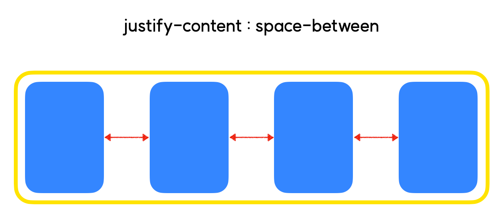
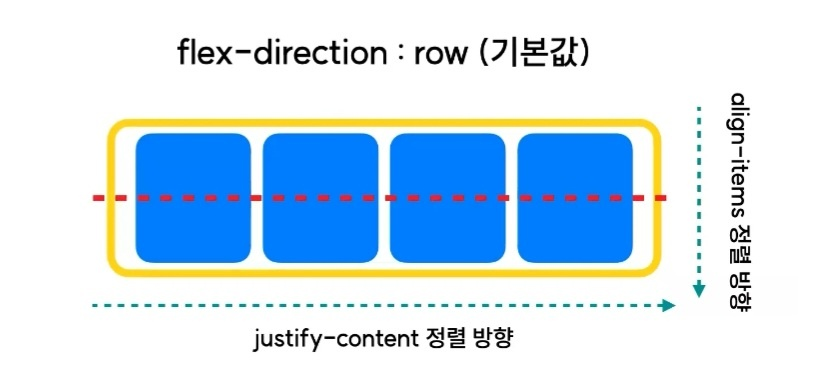

# CSS 레이아웃의 흐름
## Float → Flex → Grid
- Float : 현대 웹에서는 거의 사용하지 않음
    - 반응형 웹에 적합하지 않기 때문
- Flex, Grid : 상황에 따라 혼용하여 사용

## Float 레이아웃
### Float와 Clear
- Float : 요소가 Normal Flow로부터 벗어나서, 특정한 위치에 강제로 배치할 수 있도록 띄워줌.
- Clear : Float가 적용된 요소 혹은 Float가 적용된 요소에게 영향을 받고 있는 요소에게 추가로 줄 수 있는 속성.

## Flex 레이아웃
### 사용방법

1. 요소의 속성을 flex로 변경
    ```css
    display : flex
    ```
    - flex-container : "display : flex"가 적용된 요소
    - flex-item : flex-container의 자식요소


2. flex-direction : row | column → 중심축의 방향 결정하기    
    - 정렬의 기준이 되는 방향을 결정하는 속성
        - flex-direction : row(기본값)

            
        - flex-direct : column

            
        - 추가적으로, [row-reverse와 column-reverse](https://developer.mozilla.org/en-US/docs/Web/CSS/flex-direction) 속성으로 안에 든 아이템의 순서를 뒤집어주는 속성도 존재함.


3. justify-content : 중심축 방향 정렬

    - 우선 flex-direction : row 인 상태로 가정하고 진행
    - flex-direction을 이용하여 중심축의 방향을 결정했다면, 해당 중심축을 기준으로 아이템들을 실제로 정렬해주어야 함
    - justify-content : flex-start(기본값)
        - 컨테이너의 시작점을 기준으로 아이템이 정렬
            

    - justify-content : flex-end
        - flex-start와는 반대로, flex-container의 끝부분을 기준으로 아이템이 정렬
            

    - justify-content : center
        - flex-container의 가운데 지점을 기준으로 아이템이 정렬
            

    - justify-content : space-between
        - flex-container 내 아이템들이 균일한 여백을 두고 배치
        - 양 끝에 있는 아이템은 start와 end에 붙어있어, 해당 부분에는 여백이 존재하지 않음
            

    - justify-content : space-around
        - space-between과 달리 각각의 아이템에 균일한 좌우여백이 들어감
        - 따라서 양 끝에 있는 아이템이 start 또는 end라인과 갖는 여백은, 아이템 간의 여백보다 좁다.
            

    - justify-content : space-evenly
        - space-evenly는 모든 여백의 크기가 균일함
            

4. align-items : 중심축 반대 방향 정렬

    

    - 현재 중심축 방향은 "flex-direction : row" 로, 가로방향! 그렇다면 align-items는 중심축의 반대방향인 세로방향을 정렬해준다.
    - **※주의※** : align-items는 `flex-item이 한 줄 일때` 우선 적용! 두 줄 이상일 때에는 `align-content`라는 다른 속성을 사용해야 한다.
    - **※주의2※** : flex-direction이 바뀌면 중심축의 방향이 바뀐다! 중심축의 방향이 바뀌면, `justify-content와 align-item의 정렬 방향`도 함께 바뀌게 된다.
    - align-items : stretch(기본값)
        - 아이템의 실제 사이즈가 어떻든간에, 아이템을 쭉쭉 늘려서 container영역을 꽉 채워줌

            
    - align-items : flex-start
        - container의 시작점을 기준으로 정렬

            
    - align-items : flex-end
        - container의 끝지점을 기준으로 정렬

            
    - align-items : center
        - 중앙을 기준으로 정렬

            