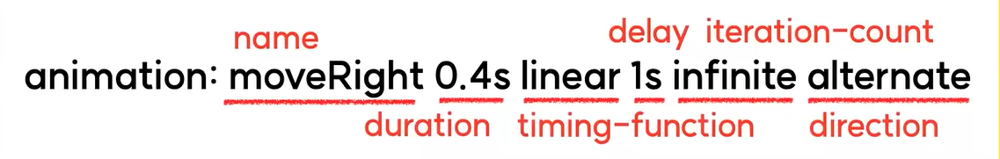

# Animation
## 1. animation 관련 속성들
- animation-name
- animation-duration
- animation-direction
- animation-iteration-count
- animation-timing-function
- animation-delay

### (1) animation-name
- 어떠한 keyframes를 요소에 적용할 것인지 지정한다.
- 사용할 keyframes의 이름을 적어주면 된다.
    ```css
    @keyframes moveRight {
        from {
            left : 0;
        }
        to {
            left : 200px;
        }
    }
    #Element {
        animation-name : moveRight;
    }
    ```

### (2) animation-duration
- 애니메이션을 한 번 재생하는데 걸리는 시간을 설정한다.
    ```css
    #Element {
        animation-duration : 2s;
    }
    ```

### (3) animation-direction
- 애니메이션 재생 방향을 정의한다.
    - normal(기본값) : 정방향으로 재생한다.
    - reverse : 역방향으로 재생한다
    - alternate : 정방향으로 재생한다. (단, 반복시 정방향/역방향을 번갈아 재생한다.)
    - alternate-reverse : 역방향으로 재생한다. (단, 반복시 역방향/정방향을 번갈아 재생한다.)
    ```css
    #Element {
        animation-direction : alternate;
    }
    ```

### (4) animation-iteration-count
- 애니메이션 재생 횟수를 정의한다.
- 특정한 숫자를 지정해주어도 되고, 제한이 없다면 infinite값을 할당한다.
- 앞서 배운 `alternate` 또는 `alternate-reverse` 로 애니메이션 반복을 주고싶을 경우, `animation-iteration-count`속성이 필요하다.
    ```css
    #Element {
        animation-iteration-count : infinite;
    }
    ```

### (5) animation-timing-function
- 애니메이션 재생 패턴을 정의한다.
- transition-timing-function과 유사하다.
    ```css
    #Element {
        animation-timing-function : ease-in-out;
    }
    ```

### (6) animation-delay
- 애니메이션 시작을 얼마나 지연할지 설정한다.
    ```css
    #Element {
        animation-delay : 2s
    }
    ```

## 2. animation 단축속성
