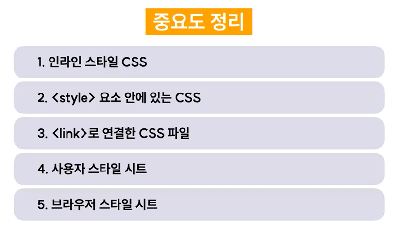

# Cascading
## cascading이란?
- 수많은 스타일 요소 중 어떤 스타일을 브라우저에 그릴지 결정해주는 CSS 우선순위 적용 원리
- 기준 3가지
    - 중요도
    - 구체성(명시도)
    - 선언순서

## 중요도
- CSS가 선언된 위치에 따라 우선순위가 결정된다.


- 개발자 스타일 시트 내에서도 우선순위가 결정된다.


- 중요도 정리


## 구체성(명시도)
- 선택할 대상을 구체적으로 특정할수록 명시도가 높아진다.
- 명시도가 높아지면 우선순위도 함께 높아진다.


- 예시
    ```html
    <body>
        <div class="text-class" id="text-id">
            텍스트 입니다.
        </div>
    </body>
    ```
    ```css
    * {
        color : red; /* 우선순위 4위 */
    }
    div {
        color : yellow; /* 우선순위 3위 */
    }
    .text-class {
        color : blue; /* 우선순위 2위 */
    }
    #text-id {
        color : violet; /* 우선순위 1위 */
    }
    ```

- 강제로 명시도 끌어올리기 : `!important`

## 선언순서
- 나중에 선언한 스타일이 우선 적용된다.
- 중요도와 명시도가 동일한 선언이 중첩되어 있을 경우, 가장 나중에 선언한 스타일이 적용된다.