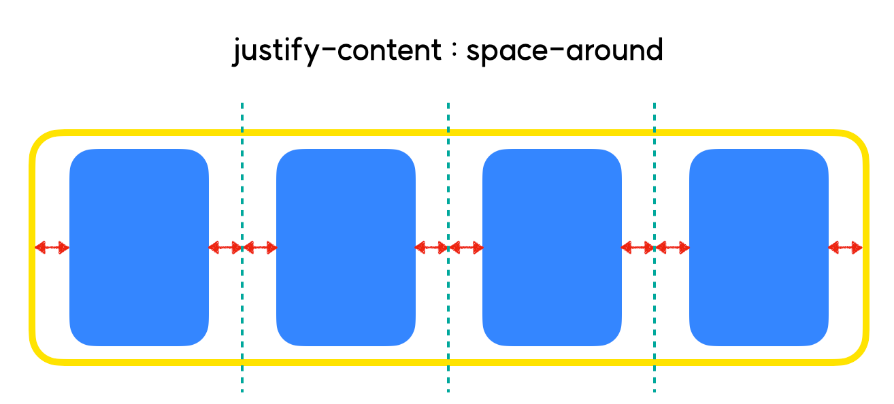
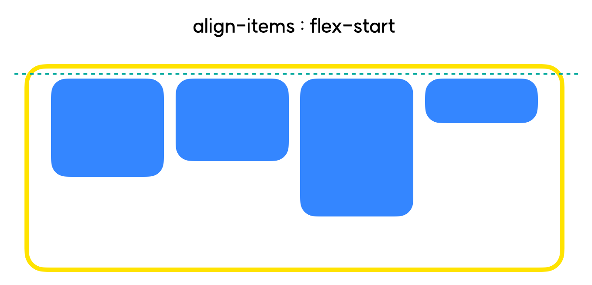
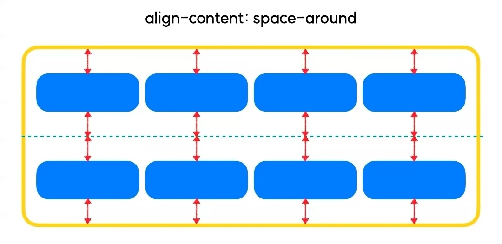

# CSS 레이아웃의 흐름
## 1. Float → Flex → Grid
- Float : 현대 웹에서는 거의 사용하지 않음
    - 반응형 웹에 적합하지 않기 때문
- Flex, Grid : 상황에 따라 혼용하여 사용

<br>
<br>
<br>

# Float 레이아웃
## 1. Float와 Clear
- Float : 요소가 Normal Flow로부터 벗어나서, 특정한 위치에 강제로 배치할 수 있도록 띄워줌.
- Clear : Float가 적용된 요소 혹은 Float가 적용된 요소에게 영향을 받고 있는 요소에게 추가로 줄 수 있는 속성.

<br>
<br>
<br>

# Flex 레이아웃
## 1. 요소의 속성을 flex로 변경
```css
display : flex
```
- flex-container : "display : flex"가 적용된 요소
- flex-item : flex-container의 자식요소

## 2. flex-direction : row | column → 중심축의 방향 결정하기    
- 정렬의 기준이 되는 방향을 결정하는 속성
    - flex-direction : row(기본값)

        
    - flex-direct : column

        
    - 추가적으로, [row-reverse와 column-reverse](https://developer.mozilla.org/en-US/docs/Web/CSS/flex-direction) 속성으로 안에 든 아이템의 순서를 뒤집어주는 속성도 존재함.

## 3. justify-content : 중심축 방향 정렬

- 우선 flex-direction : row 인 상태로 가정하고 진행
- flex-direction을 이용하여 중심축의 방향을 결정했다면, 해당 중심축을 기준으로 아이템들을 실제로 정렬해주어야 함
### 3-1. justify-content : flex-start(기본값)
- 컨테이너의 시작점을 기준으로 아이템이 정렬
    

### 3-2. justify-content : flex-end
- flex-start와는 반대로, flex-container의 끝부분을 기준으로 아이템이 정렬
    

### 3-3. justify-content : center
- flex-container의 가운데 지점을 기준으로 아이템이 정렬
    

### 3-4. justify-content : space-between
- flex-container 내 아이템들이 균일한 여백을 두고 배치
- 양 끝에 있는 아이템은 start와 end에 붙어있어, 해당 부분에는 여백이 존재하지 않음
    

### 3-5. justify-content : space-around
- space-between과 달리 각각의 아이템에 균일한 좌우여백이 들어감
- 따라서 양 끝에 있는 아이템이 start 또는 end라인과 갖는 여백은, 아이템 간의 여백보다 좁다.
    

### 3-6. justify-content : space-evenly
- space-evenly는 모든 여백의 크기가 균일함
    

## 4. align-items : 중심축 반대 방향 정렬


- 현재 중심축 방향은 "flex-direction : row" 로, 가로방향! 그렇다면 align-items는 중심축의 반대방향인 세로방향을 정렬해준다.
- **※주의※** : align-items는 `flex-item이 한 줄 일때` 우선 적용! 두 줄 이상일 때에는 `align-content`라는 다른 속성을 사용해야 한다.
- **※주의2※** : flex-direction이 바뀌면 중심축의 방향이 바뀐다! 중심축의 방향이 바뀌면, `justify-content와 align-item의 정렬 방향`도 함께 바뀌게 된다.
### 4-1. align-items : stretch(기본값)
- 아이템의 실제 사이즈가 어떻든간에, 아이템을 쭉쭉 늘려서 container영역을 꽉 채워줌

    
### 4-2. align-items : flex-start
- container의 시작점을 기준으로 정렬

    
### 4-3. align-items : flex-end
- container의 끝지점을 기준으로 정렬

    
### 4-4. align-items : center
- 중앙을 기준으로 정렬

    


## 5. flex-wrap
- wrap : 개행. 줄바꿈과 관련된 속성
- flex-item이 여러개일때, item들의 줄바꿈을 허용할 것인지 말 것인지 결정.
- 만일 줄바꿈을 허용하지 않을 경우, item이 아무리 많아져도 무조건 한 줄에 들어가도록 함.
### 5-1. flex-wrap : nowrap(기본값)
- item의 줄바꿈을 허용하지 않음.
- item이 아무리 많아져도 무조건 한 줄에 들어가게 됨.
- 무리하게 한 줄에 넣을경우, item모양이 자연히 찌그러지게 됨

    

### 5-2. flex-wrap : wrap
- item의 가로 사이즈가 container의 가로사이즈를 넘겼을때, 자연스럽게 다음 줄로 넘어감.

    

## 6. align-content
- align-items은 flex-item이 한 줄일때 적용됨.
- item이 두 줄 이상일 경우(wrap) align-content라는 속성을 써주어야 함.
### 6-1. align-content : stretch(기본값)


### 6-2. align-content : flex-start


### 6-3. align-content : flex-end


### 6-4. align-content : center


### 6-5. align-content : space-between


### 6-6. align-content : space-around


### 6-7. align-content : space-evenly


## 7. flex-flow
- flex-direction과 flex-wrap을 합쳐놓은 단축 속성
- 예시
    ```css
    flex-direction : row;
    flex-wrap : wrap;
    ```
    ```css
    flex-flow : column wrap
    ```
    - 위 두 코드는 동일한 결과를 가져온다.


## 8. flex-item 속성들
- order: item의 순서를 지정
- flex-basis : item의 기본 사이즈를 지정
- flex-shrink : 설정된 숫자값에 따라 flex-container 요소 내부에서 flex-item요소의 크기가 축소됨
- flex-grow : flex-item요소가 flex-container 요소 내부에서 할당 가능한 공간의 정도를 선언함

## 9. [실습](./FlexLayout.html)
