# Web Font
## 1. font-family
- `font-family : "폰트 이름"`
    - 폰트이름 사이 공백이 없다면 쌍따옴표 생략가능
    - 보통 `font-family` 에는 여러 폰트를 작성할 수 있는데, 이때 작성된 순서대로 우선순위를 갖게 된다. 
    - 아래 예시에선 body태그에 맑은 고딕을 우선 적용해보고, 맑은 고딕이 body요소에 알맞지 않다면 다음 순위인 돋움, 그 다음은 sans-serif 가 적용된다.
        ```css
        body {
            font-family: "맑은 고딕", "돋움", sans-serif;
        }
        ```
    - 아래 예시에선 `"ABC초콜릿"` 이라는 요소에 폰트를 적용하는데, `arial`폰트는 영문 폰트이므로 `"ABC"` 에는 적용이 되지만, `"초콜릿"`에는 적용되지 못한다.    
    두번째 순위인 `맑은 고딕`폰트는 한글 폰트이므로 `"초콜릿"`에 적용이 가능하다.    
    이러한 경우에는 `ABC`는 `arial`폰트가, `초콜릿`은 `맑은 고딕`폰트가 적용된다.
        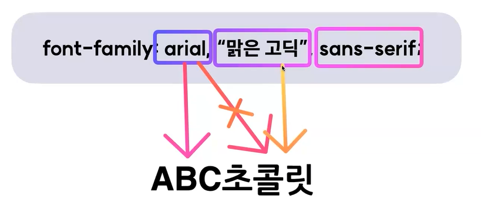
    - 마지막에 위치한 `sans-serif`폰트는 앞에 지정한 모든 폰트가 사용이 불가능할때 사용되는 일종의 안전장치이다.
    - 사용자의 컴퓨터에서 `sans-serif`계열의 폰트를 찾아 이를 적용시키는 것. 
        - sans-serif : 고딕체
        - serif : 바탕체
        - cursive : 필기체
    - ※주의 : 유저 컴퓨터에도 폰트 파일이 설치되어있어야 글씨체가 제대로 보임

## 2. 설치 없이도 사용가능한, Web Font
- 웹 전용 폰트
- 사용자가 로컬(컴퓨터)에 폰트를 직접 설치하지 않아도 특정 서버에 위치한 폰트를 다운받아 웹페이지에 표시해줌
### 적용 방법
1. 폰트 파일을 직접 다운로드 받아서 적용하는 방법 : @font-face 이용
    - 웹폰트 파일 확장자 종류 : woff / woff2 / ttf / eot
2. 외부 서비스에서 제공하는 링크를 이용하는 방법 : @import 혹은 \<link> 이용

<br>
<br>
<br>

# Font 속성
## 1. font-size
- 텍스트의 크기를 지정한다.

## 2. font-weight
- 텍스트의 두께를 지정한다.
- `bold`, `regular` 와 같은 키워드 입력도 가능하고 `100`, `200` 등 숫자 입력도 가능하다.

## 3. text-decoration
- 텍스트에 장식용 선을 추가한다.

    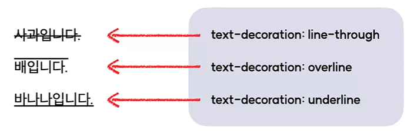

## 4. color
- 텍스트의 색을 지정한다.

## 5. line-height
- 텍스트의 행간을 설정한다.
- 설정값은 기본적으로 배율로 적용되기때문에, 배율로 적용할 것이 아닌경우 단위(px 등)를 꼭 함께 써주기

    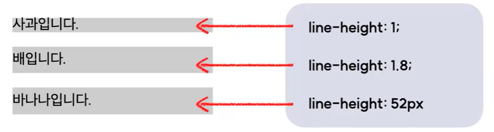

    - 위에서부터
        - 텍스트기준 1배
        - 텍스트기준 1.8배
        - 52px

## 6. letter-spacing
- 텍스트의 자간을 설정한다.
    - 기본은 `normal`

    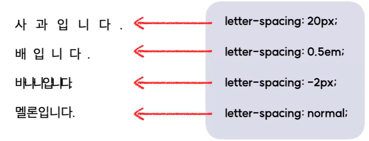

## 7. word-spacing
- 텍스트의 단어 간 간격을 지정한다.

    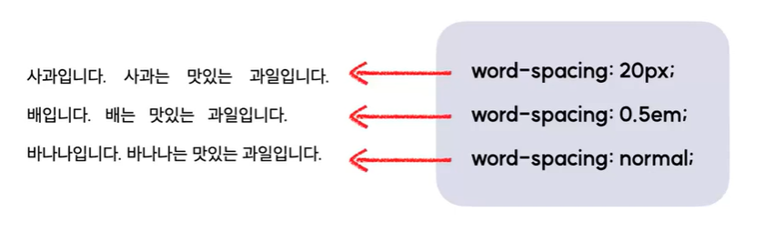

## 8. text-align
- block요소나 표 안에서 텍스트의 가로 정렬 방식을 지정한다.

    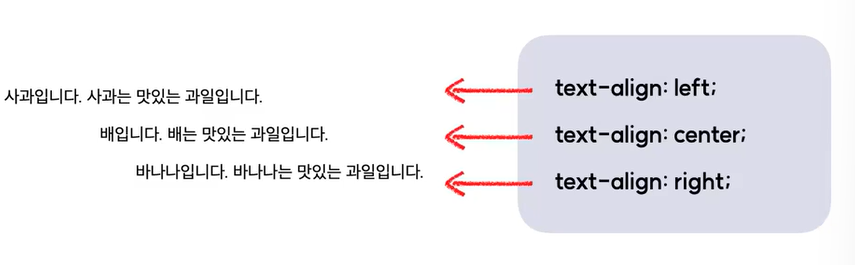

    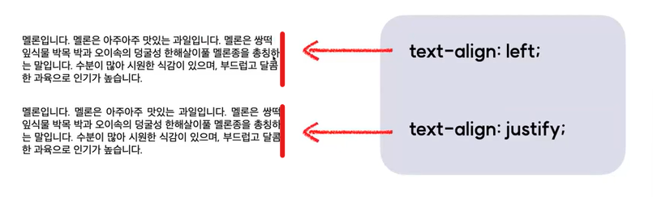

## 9. vertical-align
- inline요소나 표 안에서 텍스트의 세로 정렬 방식을 지정한다.

    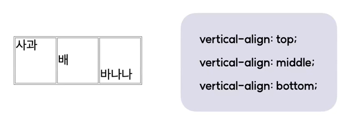

## 10. text-indent
- 텍스트의 들여쓰기를 설정한다.
    - 기본값은 0
    - 입력값으로 음수, 0, 양수 사용가능

    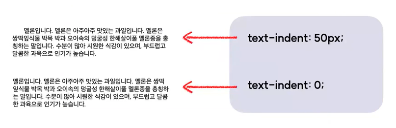

## 11. text-transform
- 영문 텍스트의 대/소문자를 바꾼다.
    - 기본값은 none

    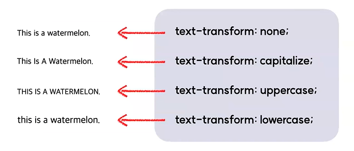

## 12. word-break
- 텍스트가 콘텐츠 박스 영역 밖으로 넘쳤을 때, 어떻게 줄을 바꿀지 설정한다.

    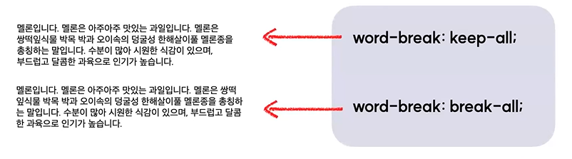

    - `word-break : keep-all;` : 행을 나눌때, 어절단위(띄어쓰기)로 나눔
    - `word-break : break-all;` : 행을 나눌때, 글자단위로 나눔

## 13. overflow-wrap
- 단어가 콘텐츠 박스 영역 밖으로 넘쳤을 때, 줄바꿈 여부를 설정한다.

    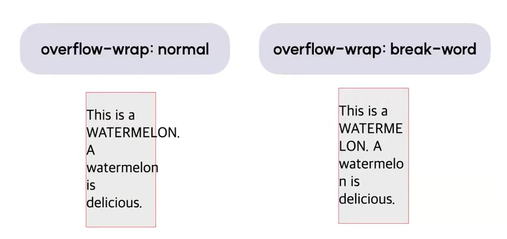

- 앞서 배운 `word-break : break-all` 과 비교해본다.

    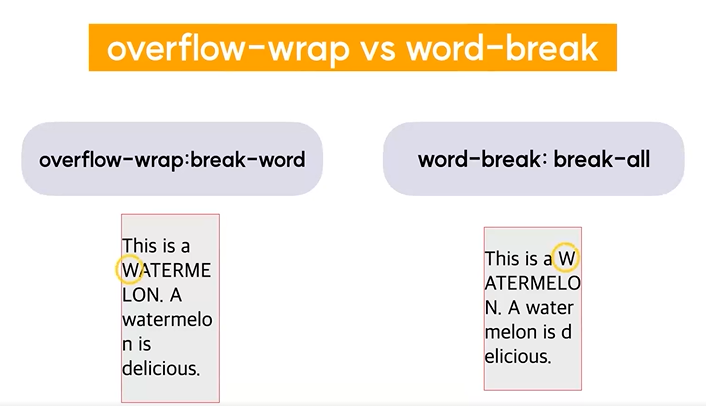
    - 두 속성은 비슷해보이지만 차이점이 존재한다.
    - `overflow-wrap: break-word;` 는 기본적으로 음절(띄어쓰기)을 기준으로 줄을 바꾸지만, 예시에 나온 WATERMELON처럼 한 줄에 들어가지 않는 긴 단어에 한해서만 영역을 벗어나는 부분을 줄바꿈해준다.
    - 반면에 `word-break: break-all;`은 글자단위로 줄바꿈을 하므로 WATERMELON 이라는 한 단어가 W/ATERMELO/N 과 같이 3줄로 쪼개지면서 가독성이 떨어진다.
    - 따라서 위와 같은 상황에선 `overflow-wrap: break-word;` 를 사용하는 것이 좋다.

## 14. overflow
- 콘텐츠가 커서 요소 안에서 내용을 다 보여주기 힘들 때, 어떤 방식으로 보여줄지 설정한다.

    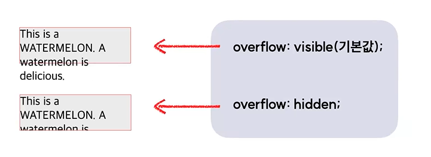

    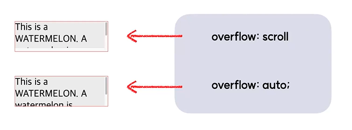
    
    - `overflow : auto;` 는 평소에는 스크롤이 없다가, 콘텐츠가 요소 밖으로 넘칠때 스크롤이 생김

## 15. text-overflow
- **※줄바꿈을 하지 않을 때※**, 요소 밖으로 넘치는 text를 어떻게 표기할 것인지 설정한다.
- "줄바꿈을 하지 않을 때" 라는 선행조건을 만족하기 위해서는 아래의 선언들도 함께 적용되어야 한다.
    ```css
    white-space : nowrap;
    overflow : hidden;
    ```
