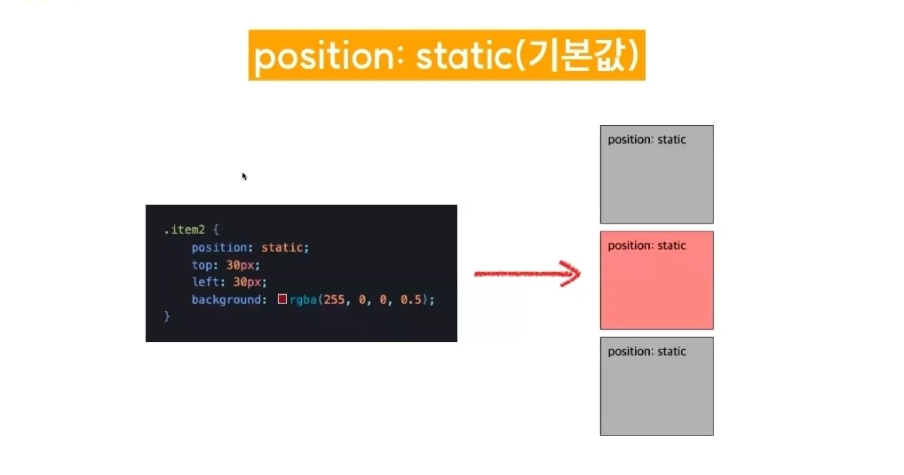
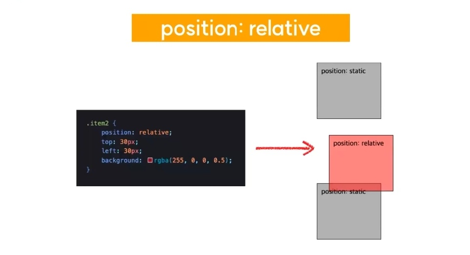
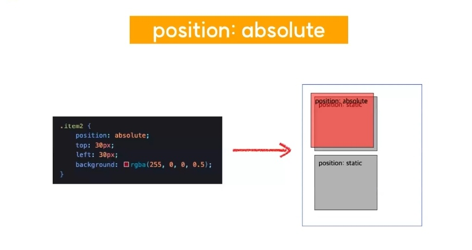
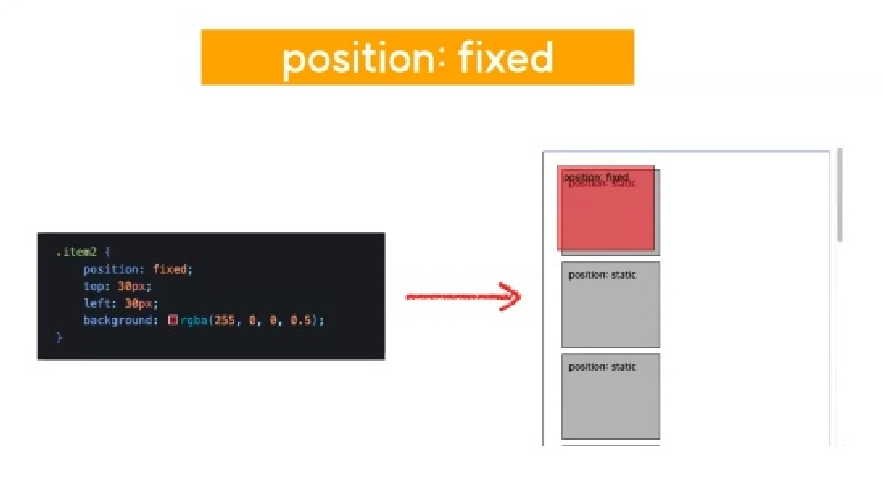
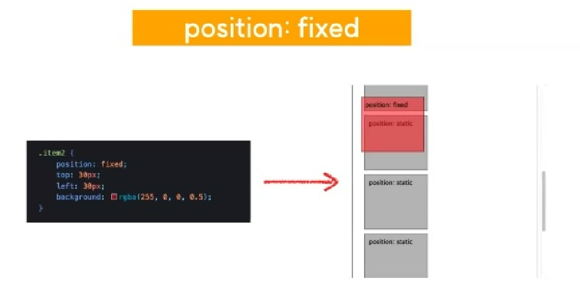
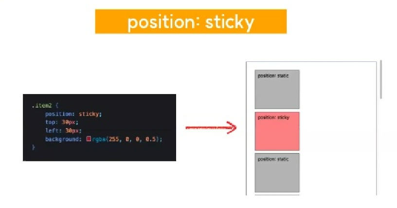
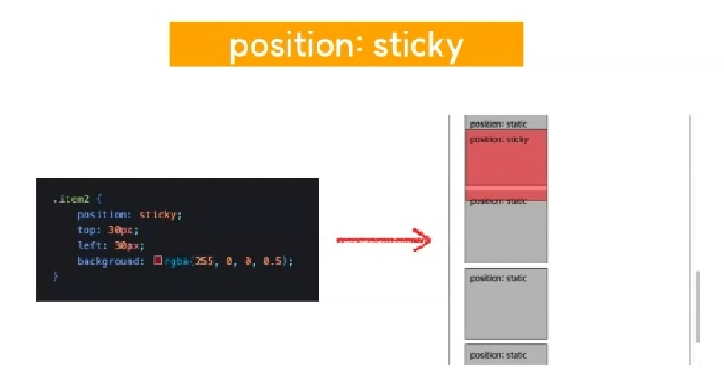
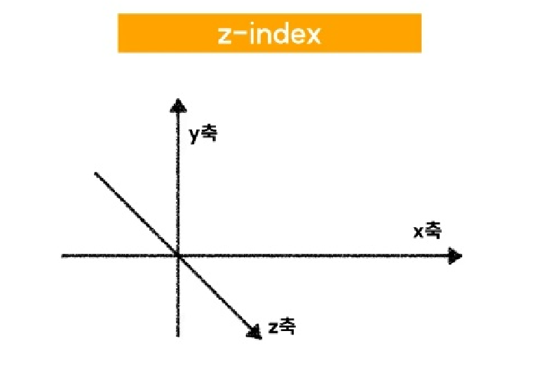
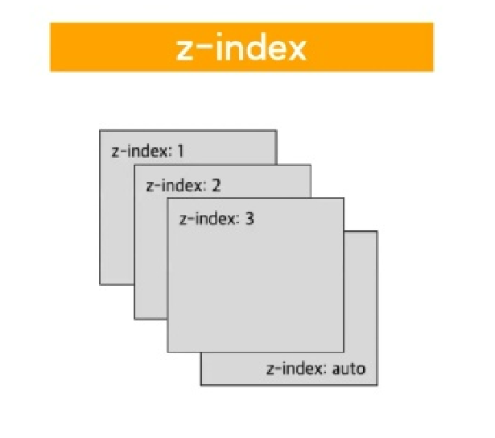

# Position
## 1. position
- HTML 요소가 배치되는 방식을 결정하는 속성
- position 값
    - static(기본값)
    - relative
    - absolute
    - fixed
    - sticky
- 속성 : top/left/bottom/right
    - 해당 방향 기준으로 요소의 좌표값을 변경한다.

## 2. position : static(기본값)
- 요소를 문서상 원래 있어야 하는 위치에 배치한다.
- top/left/bottom/right 적용 불가능

## 3. position : relative
- 원래 있던 자리를 기준으로 요소의 위치를 조정할 수 있다.
- top/left/bottom/right 적용 가능
- top/left/bottom/right 를 지정해주지 않으면 `position : static` 과 동일하다. 
    - 즉, `position : static` 일때 있었던 자리를 기준으로 움직일 수 있다.

## 4. position : absolute
- 절대 좌표를 기준으로 요소의 위치를 조정할 수 있다.
    - 이때 기준이 되는 절대좌표는 다음과 같다.
        - 해당 요소의 부모 요소 중 `position : relative`가 적용된 요소
        - 부모 요소 중 `position : relative`가 적용된 요소가 하나도 없을 경우, html의 body전체를 그 기준으로 삼음
- top/left/bottom/right 적용 가능

## 5. position : fixed
- 스크롤과 무관하게 뷰포트를 기준으로 요소의 위치를 설정할 수 있다.
    - 기준 : viewport

## 6. position : sticky
- 요소의 원래 위치에 있다가 스크롤이 내려가면 지정한 좌표에 고정.
    - 스크롤이 내려가면 지정한 좌표에 고정됨
    - 기준 : 부모 요소의 좌표

    
## 7. z-index
- 여러개의 요소가 겹쳐져 있을 때, 무엇이 앞으로 나올지 결정하는 속성.
    - 기본값 : auto

