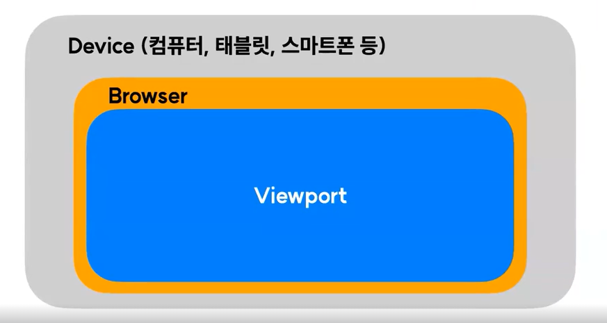

# breakPoint
## 1. viewPort

- break point란 반응형 웹사이트 작업의 기준이 되는 중단점을 의미
- 간단하게 말해서, pc / 태블릿 / 모바일의 기준이 되는 규격 분기

- 일반적으로 사용하는 breakPoint
<table style="width:100%">
    <thead>
        <tr>
            <th>크기</th>
            <th>중단점</th>
        </tr>
    </thead>
    <tbody>
        <tr>
            <td>Mobile</td>
            <td>0 ~ 767px</td>
        </tr>
        <tr>
            <td>Tablet</td>
            <td>768px ~ 1023px</td>
        </tr>
        <tr>
            <td>PC</td>
            <td>1024px ~ 1439px</td>
        </tr>
        <tr>
            <td>PC Large</td>
            <td>1440px ~</td>
        </tr>
    </tbody>
</table>

## [실습](./breakPoint.html)