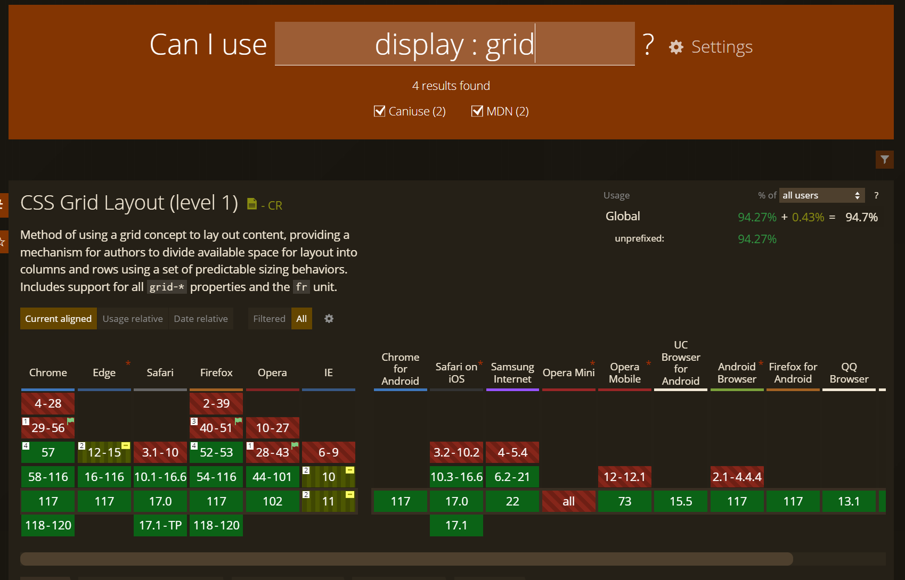

# flex와 grid의 차이점
## 1. Flex
- 비교적 작은 단위의 레이아웃 구성에 적합하다.
- 작업 유동성이 높기 때문에, 디자인이나 기획이 확실하게 잡히지 않아 **변경 가능성이 있는 경우에 적합하다.**
    - grid의 경우 한번 변경이 이뤄지면 전체 레이아웃을 다 뜯어고쳐야 하기때문에 변경 가능성이 있다면 Flex레이아웃이 적합하다.

## 2. Grid
- 큰 규모의 레이아웃 구성에 적합하다.
- 레이아웃 구조가 확실하게 잡혀있는 경우, 효율적으로 반응형 디자인을 구현할 수 있다.
- ※ 단, Grid는 상대적으로 최신 기술이기 때문에 모든 브라우저에서 지원하지 않는다.
    - [브라우저별 CSS속성 지원유무 확인 사이트](https://caniuse.com)
        