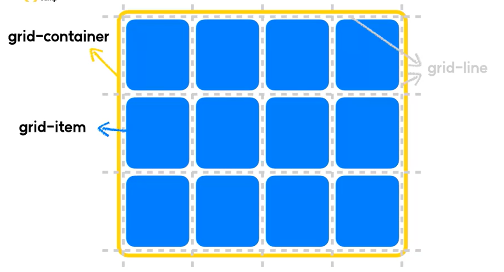
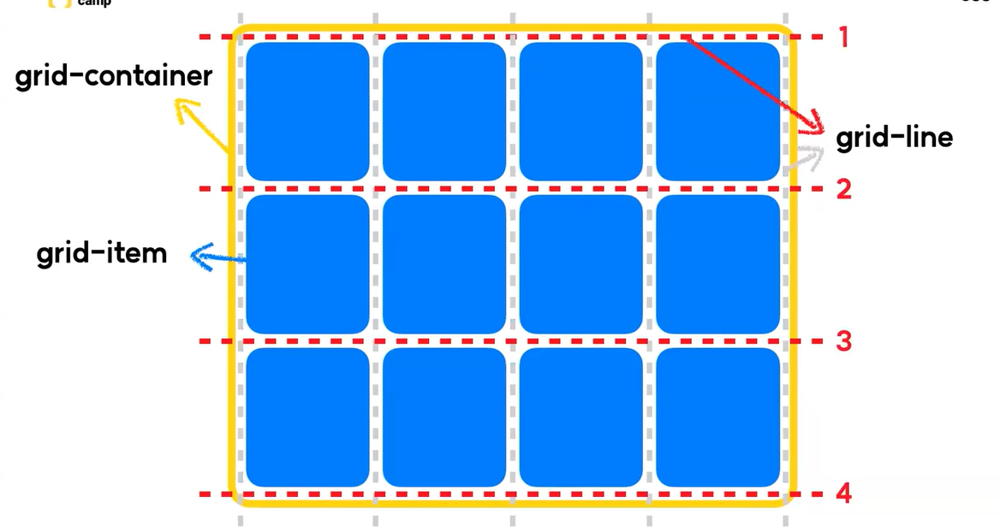
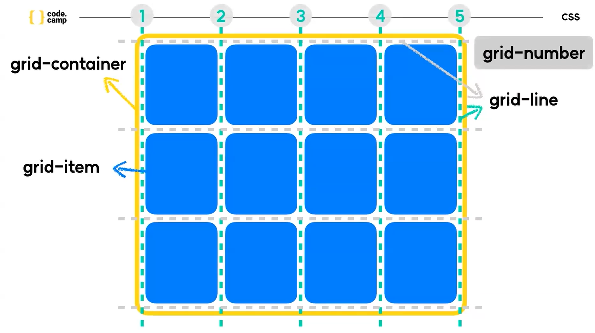
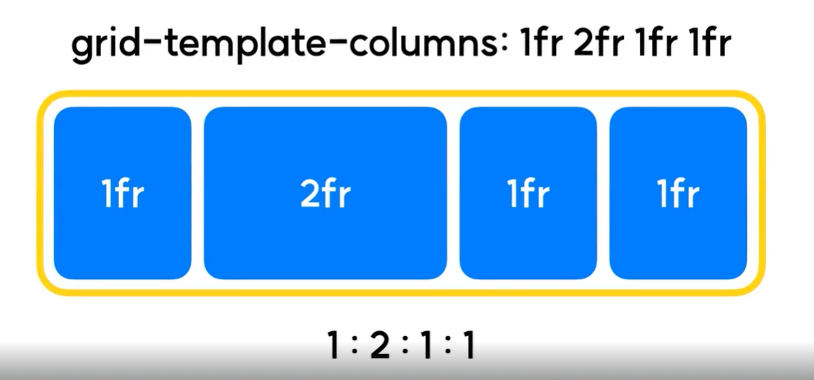

# grid 속성
## 1. 사용법
### (1) 요소의 속성을 grid로 변경
- 요소에다 `display : grid` 를 주었을때, 그 요소는 `grid container`가 되며, 그 자식요소들은 `grid item`이 된다.
- 또한 gird layout에는 `grid-line`과 `grid-number`가 있다.
    - grid-line : 열과 행을 나누는 각각의 경계
    - grid-number : 각각의 라인이 몇번째 라인인지를 뜻하는 숫자
    - 이러한 경계와 숫자들이 차후 grid item을 배치할때 굉장히 중요한 기준 역할을 하게 된다.

    
    
    

### (2) grid-template-rows / grid-template-columns
- grid-template-rows
    - grid의 행의 개수 및 크기를 지정할 수 있다.
    - `grid-template-rows : 1fr 2fr 200px`
        - 해당 grid의 행은 3개이며, 각 행의 규격은 1fr, 2fr, 200px라는 의미이다.
- grid-template-columns
    - grid의 열의 개수 및 크기를 지정할 수 있다.
    - `grid-template-columns : 1fr 2fr 200px`
        - 해당 grid의 열은 3개이며, 각 열의 규격은 1fr, 2fr, 200px라는 의미이다.
- **fr** : fraction(분수)의 약자, grid-template에서 사용할 수 있는 비율 단위.
    
- **repeat(a, b)** : grid-template에서 사용할 수 있는 반복 함수. b규격의 grid-template을 a개 생성한다.

