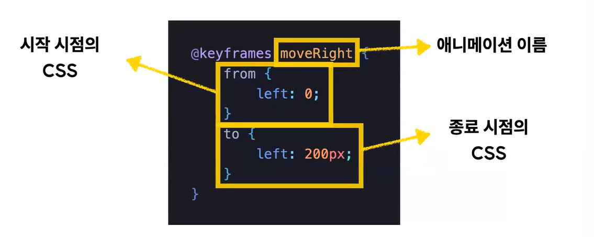

# keyframes
## 1. @keyframes란?
- CSS 애니메이션의 시작, 중간, 끝 등의 중간상태를 정의한다.
- 작성방법 예시
    
    - from & to 대신 진행도(%) 표기도 가능하다
        ```css
        @keyframes moveRight {
            0% {
                left : 0;
            }
            50% {
                left : 200px;
            }
            100% {
                left : 200px;
            }
        }
        ```

## 2. @keyframes를 요소에 적용하는 법 = animation 속성을 이용한다
