# 배경
## background-color
- 요소의 배경에 색상을 지정

## background-image
- `background-image: url("이미지 경로")`
- 요소의 배경 이미지를 한 개, 혹은 여러 개 지정한다.
    - 콤마(,)를 이용하여 여러 이미지를 배경으로 지정할 수 있다.
    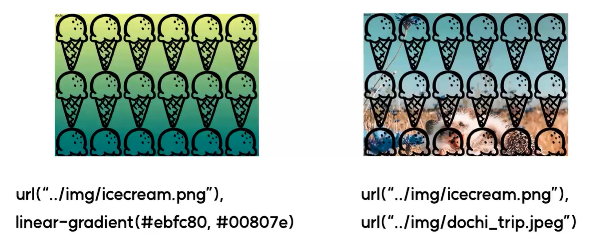
        - 이때 앞에 지정한 이미지일수록 가장 위에 나타나게 된다.
- 그라데이션 지정도 가능하다.
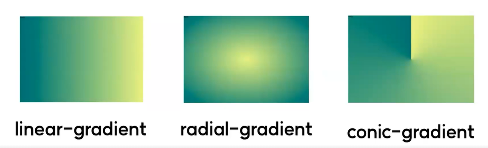
    1. linear-gradient() : 그라데이션이 깔린 이미지를 생성하는 CSS 내장기능. 직선형
        - `background-image: linear-gradient(to top, red, blue)`
        - `background-image : linear-gradient(방향, 시작색상, 종료색상)`
        - 방향 : to left, to right, to top, to bottom, 생략가능
    2. radial-gradient() : 그라데이션이 깔린 이미지를 생성하는 CSS 내장기능. 원형
    3. conic-gradient()  : 그라데이션이 깔린 이미지를 생성하는 CSS 내장기능. 콘형

## background-position
- `background-position: center`
- 요소의 배경 이미지의 위치를 지정한다.
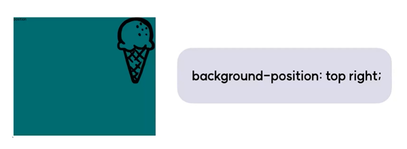
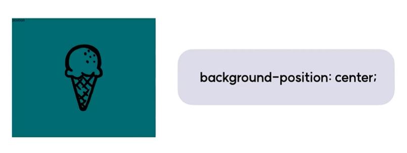
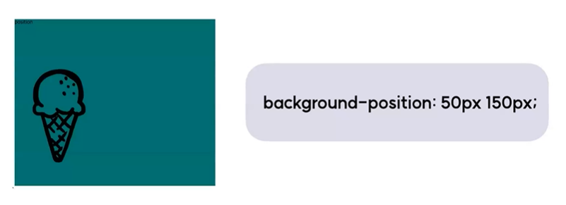

## background-repeat
- `background-repeat: no-repeat`
- 요소의 배경 이미지의 반복 여부, 반복 방향을 지정한다. (기본값 : repeat)
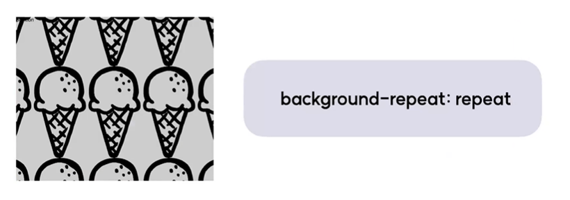
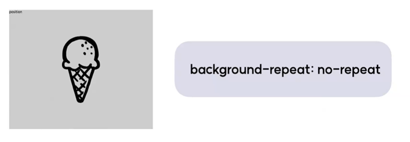
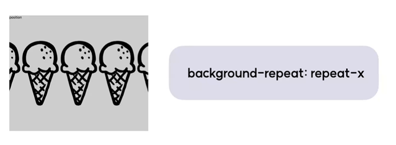
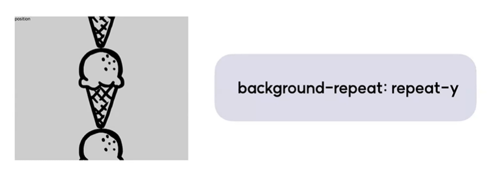

## background-size
- `background-size: cover`
- 요소의 배경 이미지의 크기를 지정한다.
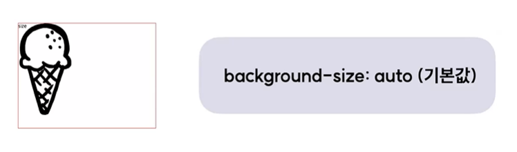
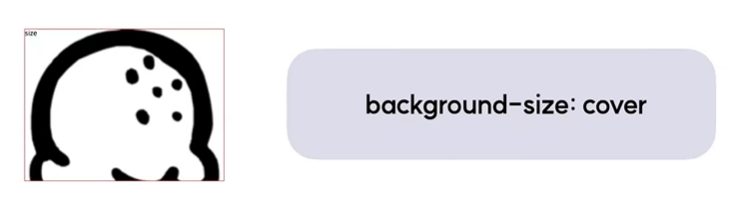
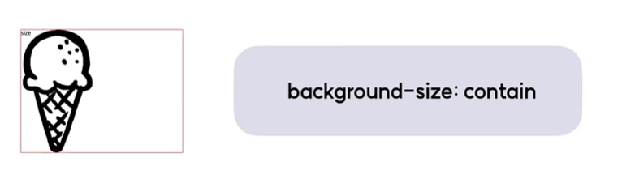
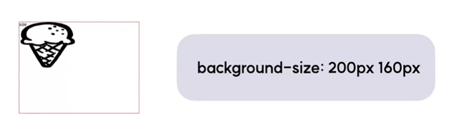

## background-attachment
- `background-attachment: fixed`
- 요소의 배경 이미지의 스크롤 여부를 지정한다.
    - background-attachment: scroll; (기본값)
    - background-attachment: fixed;
    - background-attachment: local;

## background 단축속성
- background 관련 속성들을 한 번에 지정할 수 있다.
- background: color image repeat position/size attachment
    - `background: red url("../star.png") no-repeat center/cover fixed`

## object-fit
- `object-fit: cover`
- \나 \<video> 등 대체요소의 내용이 지정된 너비와 높이에 맞춰지는 방식을 지정한다.
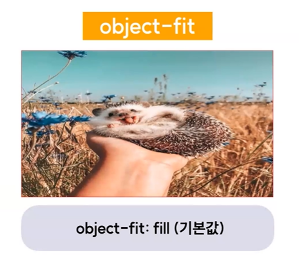
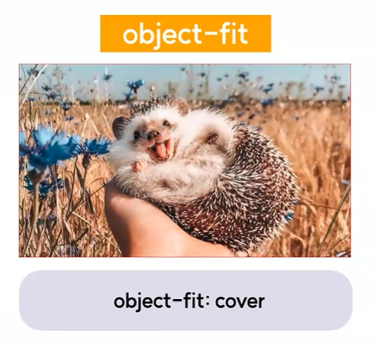
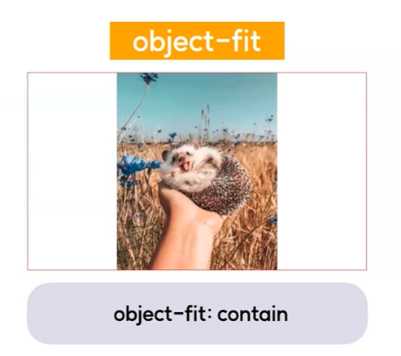
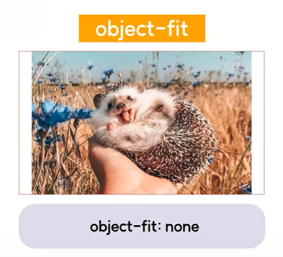

## object-position
- `object-position: center top`
- \나 \<video> 등 대체요소의 콘텐츠 정렬 방식을 지정한다.
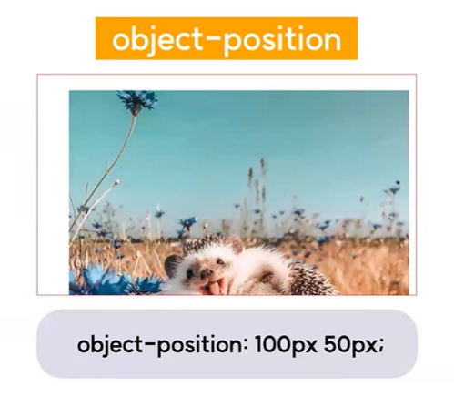
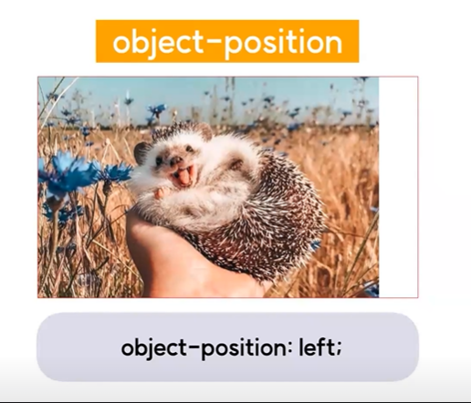
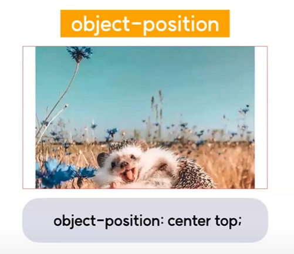